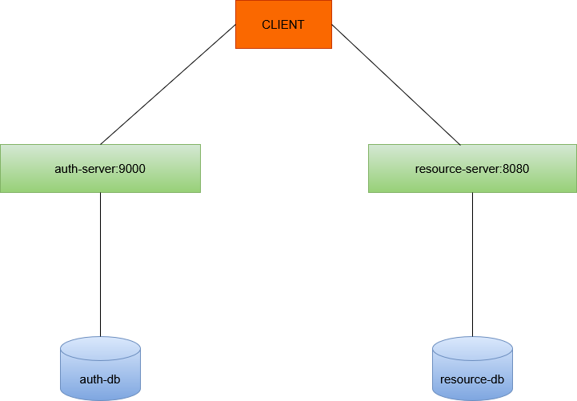

### The final task in the courses at the Senla company.

#### RESTful web service that implements functionality for social network.

###### Author: Lashkevich Artem.

#### Description:

##### The idea of the application is to allow people to communicate via REST-interface. The application provides the ability to register users, edit user's personal information, search for a user by several parameters (last name, first name, age, gender), exchange messages between two users and between more than two users, send public messages, add a user as a friend, view information about another user, join communities with a separate wall of posts.

##### The application is built on a microservice architecture and contains two microservices.

##### There two microservices (auth-service and resource-server), each of which works with a one database.

##### The authorization server is in charge of issuing receive a JWT token for users registered in the system.

##### The resource server is responsible for the rest of the logic described above

#### Stack:

Java, Spring Boot, PostgresSQL, Liquibase, Docker

#### How to run:

1. Go to the root of the application and run the buildApp.sh script

#### Ports exposed:

8080 - resource-server
9000 - auth-server

#### Registration procedure in the system:

1. To register in the system: POST http://localhost:8080/user (Request body: email, password, firstName, lastName, birthDay, gender)
   By default, registration in the system is carried out with the role of ROLE_USER.
2. For get a JWT token in postman, select the Oauth2.0 authentication type
   and specify the following parameters:
   - Header Prefix - Bearer
   - Grant type - Authorization Code
   - Callback URL - https://oauth.pstmn.io/v1/callback
   - Auth URL - http://localhost:9000/oauth2/authorize
   - Access Token URL -http://localhost:9000/oauth2/token
   - Client ID - oidc_client,  
   - Client Secret - secret,  
   - Scope - openid profile,  
   - Client Authentication - Send as Basic Auth header

#### Credentials of registered users:

1. ADMIN - email: elizabeth@example.com, password: elizabeth
2. USER - email: christopher@example.com, password: christopher
3. MODERATOR - email: victoria@example.com, password: victoria

